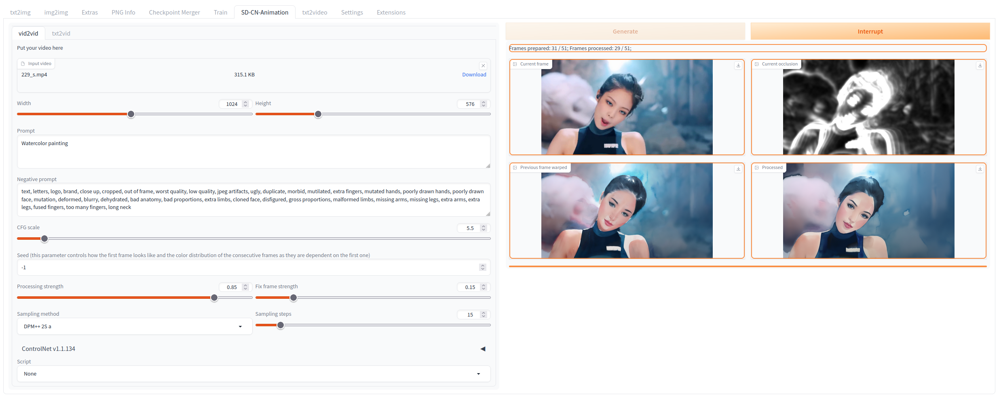
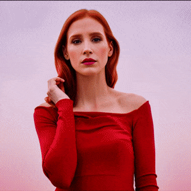
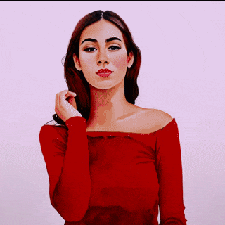
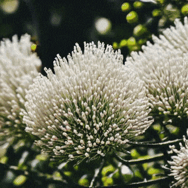
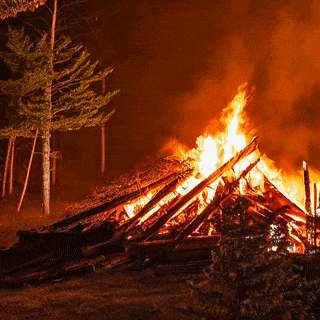
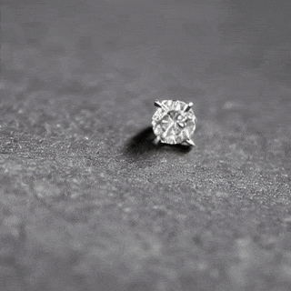
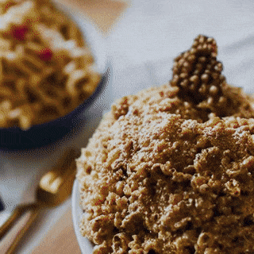

# SD-CN-Animation
This project allows you to automate video stylization task using StableDiffusion and ControlNet. It also allows you to generate completely new videos from text at any resolution and length in contrast to other current text2video methods using any Stable Diffusion model as a backbone, including custom ones. It uses '[RAFT](https://github.com/princeton-vl/RAFT)' optical flow estimation algorithm to keep the animation stable and create an occlusion mask that is used to generate the next frame. In text to video mode it relies on 'FloweR' method (work in progress) that predicts optical flow from the previous frames.

sd-cn-animation ui preview

### Video to Video Examples:
</table>
<table class="center">
<tr>
 <td></td>
 <td></td>
 <td></td>
</tr>
<tr>
 <td width=33% align="center">Original video</td>
 <td width=33% align="center">"Jessica Chastain"</td>
 <td width=33% align="center">"Watercolor painting"</td>
</tr>
</table>

Examples presented are generated at 1024x576 resolution using the 'realisticVisionV13_v13' model as a base. They were cropt, downsized and compressed for better loading speed. You can see them in their original quality in the 'examples' folder. 

### Text to Video Examples:
</table>
<table class="center">
<tr>
 <td></td>
 <td></td>
 <td></td>
</tr>
<tr>
 <td width=33% align="center">"close up of a flower"</td>
 <td width=33% align="center">"bonfire near the camp in the mountains at night"</td>
 <td width=33% align="center">"close up of a diamond laying on the table"</td>
</tr>
<tr>
 <td></td>
 <td></td>
 <td></td>
</tr>
<tr>
 <td width=33% align="center">"close up of macaroni on the plate"</td>
 <td width=33% align="center">"close up of golden sphere"</td>
 <td width=33% align="center">"a tree standing in the winter forest"</td>
</tr>
</table>

All examples you can see here are originally generated at 512x512 resolution using the 'sd-v1-5-inpainting' model as a base. They were downsized and compressed for better loading speed. You can see them in their original quality in the 'examples' folder. Actual prompts used were stated in the following format: "RAW photo, {subject}, 8k uhd, dslr, soft lighting, high quality, film grain, Fujifilm XT3", only the 'subject' part is described in the table above.

## Installing the extension
To install the extension go to 'Extensions' tab in [Automatic1111 web-ui](https://github.com/AUTOMATIC1111/stable-diffusion-webui), then go to 'Install from URL' tab. In 'URL for extension's git repository' field inter the path to this repository, i.e. 'https://github.com/volotat/SD-CN-Animation.git'. Leave 'Local directory name' field empty. Then just press 'Install' button. Restart web-ui, new 'SD-CN-Animation' tab should appear. All generated video will be saved into 'stable-diffusion-webui/outputs/sd-cn-animation' folder.

## Last version changes: v0.7
* Text to Video mode added to the extension
* 'Generate' button is now automatically disabled while the video is generated
* Added 'Interrupt' button that allows to stop video generation process
* Now all necessary models are automatically downloaded. No need for manual preparation.