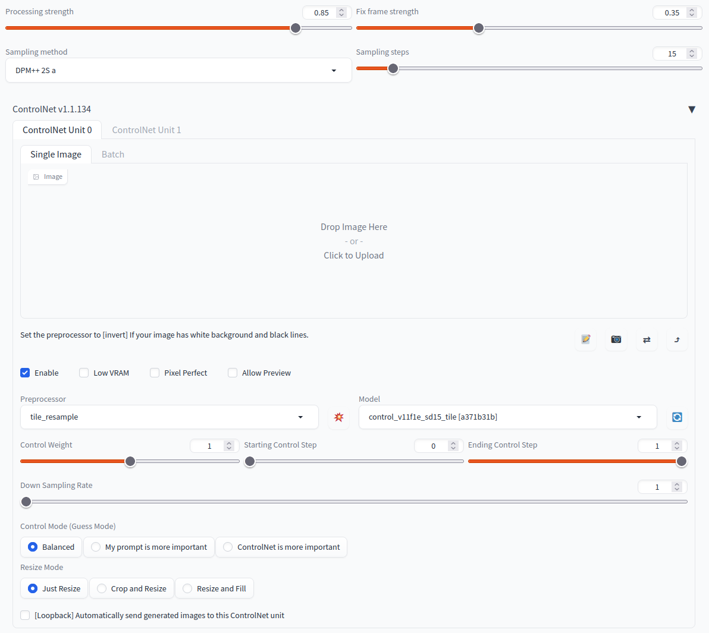

# SD-CN-Animation
This project allows you to automate video stylization task using StableDiffusion and ControlNet. It also allows you to generate completely new videos from text at any resolution and length in contrast to other current text2video methods using any Stable Diffusion model as a backbone, including custom ones. It uses '[RAFT](https://github.com/princeton-vl/RAFT)' optical flow estimation algorithm to keep the animation stable and create an occlusion mask that is used to generate the next frame. In text to video mode it relies on 'FloweR' method (work in progress) that predicts optical flow from the previous frames.


sd-cn-animation ui preview

**In vid2vid mode do not forget to activate ControlNet model to achieve better results. Without it the resulting video might be quite choppy. Do not put any images in CN as the frames would pass automatically from the video.**  
Here are CN parameters that seem to give the best results so far:  



### Video to Video Examples:
</table>
<table class="center">
<tr>
 <td></td>
 <td></td>
 <td></td>
</tr>
<tr>
 <td width=33% align="center">Original video</td>
 <td width=33% align="center">"Jessica Chastain"</td>
 <td width=33% align="center">"Watercolor painting"</td>
</tr>
</table>

Examples presented are generated at 1024x576 resolution using the 'realisticVisionV13_v13' model as a base. They were cropt, downsized and compressed for better loading speed. You can see them in their original quality in the 'examples' folder. 

### Text to Video Examples:
</table>
<table class="center">
<tr>
 <td></td>
 <td></td>
 <td></td>
</tr>
<tr>
 <td width=33% align="center">"close up of a flower"</td>
 <td width=33% align="center">"bonfire near the camp in the mountains at night"</td>
 <td width=33% align="center">"close up of a diamond laying on the table"</td>
</tr>
<tr>
 <td></td>
 <td></td>
 <td></td>
</tr>
<tr>
 <td width=33% align="center">"close up of macaroni on the plate"</td>
 <td width=33% align="center">"close up of golden sphere"</td>
 <td width=33% align="center">"a tree standing in the winter forest"</td>
</tr>
</table>

All examples you can see here are originally generated at 512x512 resolution using the 'sd-v1-5-inpainting' model as a base. They were downsized and compressed for better loading speed. You can see them in their original quality in the 'examples' folder. Actual prompts used were stated in the following format: "RAW photo, {subject}, 8k uhd, dslr, soft lighting, high quality, film grain, Fujifilm XT3", only the 'subject' part is described in the table above.

## Installing the extension
To install the extension go to 'Extensions' tab in [Automatic1111 web-ui](https://github.com/AUTOMATIC1111/stable-diffusion-webui), then go to 'Install from URL' tab. In 'URL for extension's git repository' field inter the path to this repository, i.e. 'https://github.com/volotat/SD-CN-Animation.git'. Leave 'Local directory name' field empty. Then just press 'Install' button. Restart web-ui, new 'SD-CN-Animation' tab should appear. All generated video will be saved into 'stable-diffusion-webui/outputs/sd-cn-animation' folder.

## Known issues
* If you see error like this ```IndexError: list index out of range``` try to restart webui, it should fix it. If the issue still prevelent try to uninstall and reinstall scikit-image==0.19.2 with no --no-cache-dir flag like this.
```
pip uninstall scikit-image
pip install scikit-image==0.19.2 --no-cache-dir
```
* The extension might work incorrectly if 'Apply color correction to img2img results to match original colors.' option is enabled. Make sure to disable it in 'Settings' tab -> 'Stable Diffusion' section. 
* If you have an error like 'Need to enable queue to use generators.', please update webui to the latest version. Beware that only [Automatic1111 web-ui](https://github.com/AUTOMATIC1111/stable-diffusion-webui) is fully supported.
* The extension is not compatible with Macs. If you have a case that extension is working for you or do you know how to make it compatible, please open a new discussion. 

## Last version changes: v0.9
* Fixed issues #69, #76, #91, #92.
* Fixed an issue in vid2vid mode when an occlusion mask computed from the optical flow may include unnecessary parts (where flow is non-zero).
* Added 'Extra params' in vid2vid mode for more fine-grain controls of the processing pipeline.
* Better default parameters set for vid2vid pipeline.
* In txt2vid mode after the first frame is generated the seed is now automatically set to -1 to prevent blurring issues.
* Added an option to save resulting frames into a folder alongside the video.
* Added ability to export current parameters in a human readable form as a json.
* Interpolation mode in the flow-applying stage is set to ‘nearest’ to reduce overtime image blurring.
* Added ControlNet to txt2vid mode as well as fixing #86 issue, thanks to [@mariaWitch](https://github.com/mariaWitch)
* Fixed a major issue when ConrtolNet used wrong input images. Because of this vid2vid results were way worse than they should be.
* Text to video mode now supports video as a guidance for ControlNet. It allows to create much stronger video stylizations.

<!--
* ControlNet with preprocessers like "reference_only", "reference_adain", "reference_adain+attn" are not reseted with video frames to have an ability to control style of the video.
* Fixed an issue because of witch 'processing_strength' UI parameters does not actually affected denoising strength at the fist processing step.
* Fixed issue #112. It will not try to reinstall requirements at every start of webui.
-->
